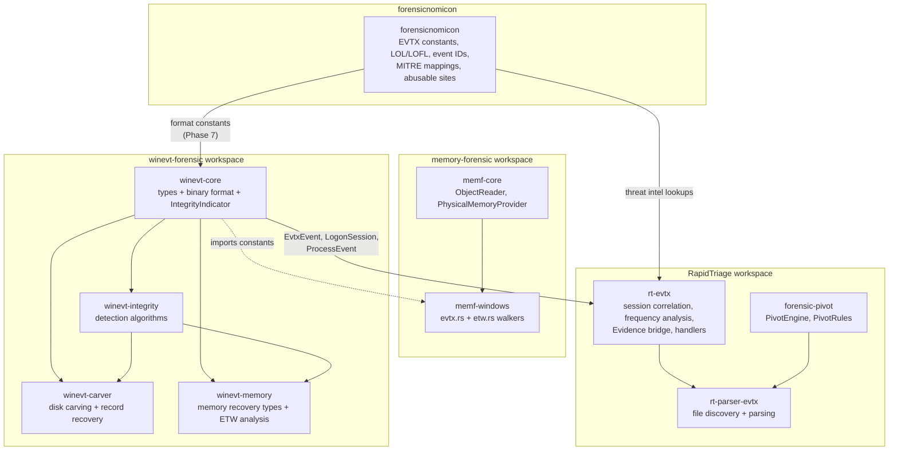

# PLAN.md -- winevt-forensic Workspace Architecture

**Date:** 2026-05-04
**Status:** ACTIVE (Phases 0-3 DONE, Phases 4-6 PENDING)

---

## 1. Grand Vision: Three-Repo Forensic Architecture

The forensic tooling follows a **dissect.target-inspired** layered architecture: deep artifact knowledge lives in portable, standalone library crates. Orchestration, correlation, and triage logic stays in the orchestration layer (RapidTriage).

```
Artifact Libraries (pure, no CLI)       Orchestration Layer (CLI + correlation)
------------------------------------     ----------------------------------------
winevt-forensic   -- EVTX forensics     RapidTriage (rt CLI)
srum-forensic     -- ESE/SRUM parsing      rt-evtx      wraps winevt-forensic
browser-forensic  -- browser history       rt-parser-*  wraps each artifact lib
memory-forensic   -- memory dumps          rt-mem       wraps memf-windows
forensicnomicon   -- threat intel          forensic-pivot  correlation engine
```

Each artifact library is a standalone public crate (publishable to crates.io) with zero knowledge of RapidTriage. RapidTriage wrapping crates add: file discovery, Evidence bridge, PivotRule integration, timeline emission, and cross-artifact correlation.

The memory-forensic repo (`memf-windows`) handles memory-specific walkers (`ObjectReader<P>`, virtual address translation, ISF symbols). It can depend on artifact libraries for shared constants (e.g., `winevt-core` for EVTX magic bytes), but artifact libraries never depend on `memf-core`.

---

## 2. The Anti-Forensic Question: Definitively Answered

**Q: Should winevt-integrity belong to RapidTriage?**

**A: NO. Anti-forensic detection stays in winevt-forensic.**

### Reasoning

1. **Anti-forensic detection is artifact-layer knowledge.** CRC32 mismatches, record ID gaps, and timestamp anomalies are structural properties of the EVTX binary format. They are not triage decisions. Detecting a `ChunkChecksumMismatch` requires knowing that bytes `0x00..0x78` of a chunk header are CRC32'd and stored at offset `0x78` -- this is EVTX format knowledge, not orchestration logic.

2. **Circular dependency prevention.** `winevt-carver` calls `winevt-integrity` functions during carving to populate `CarvedChunk.anti_forensic`. If anti-forensic detection lived in RapidTriage, we'd have: RapidTriage -> winevt-carver -> RapidTriage (circular).

3. **Multiple consumers benefit.** Both the disk carver (`winevt-carver`) and the memory scanner (`memf-windows`) can run the same anti-forensic checks on recovered chunks. Placing detection in winevt-forensic makes it available to all consumers without RapidTriage as a dependency.

4. **The dissect.target pattern.** Detect at the artifact layer. Correlate at the triage layer.

### What Stays Where

| Concern | Owner | Examples |
|---------|-------|----------|
| **Detection** (structural anomaly) | `winevt-integrity` | `detect_record_id_gaps()`, `verify_chunk_header_checksum()`, `check_timestamp_monotonicity()`, `check_file_header_consistency()` |
| **Types** (indicator enum) | `winevt-core` | `IntegrityIndicator` enum with all variants |
| **Response** (triage action) | RapidTriage `rt-evtx` | Converting `IntegrityIndicator` into `Evidence` objects, raising correlation findings, escalating via `PivotEngine`, enriching with forensicnomicon lookups |

---

## 3. forensicnomicon's Role: The Single Source of Truth for Format Knowledge

`forensicnomicon` is the **authoritative knowledge base** for all DFIR artifact formats, threat intelligence, and lookup data. It is the single source of truth for:

- Binary format constants (magic bytes, struct layouts, field offsets) for all artifact types — EVTX, ESE/SRUM, browser databases, registry hives
- LOL/LOFL datasets (`lolbins.rs`) -- "is this binary a Living Off the Land binary?"
- Abusable sites catalog (`abusable_sites.rs`)
- MITRE ATT&CK mappings (`mitre.rs`), Sigma rule references (`sigma.rs`)
- Anti-forensics awareness (`antiforensics_aware.rs`)
- Event ID catalogs (`eventids.rs`)
- The `4n6query` CLI for querying all of the above

**All format constants belong in forensicnomicon. Parser crates (winevt-core, ese-core, browser-core) depend on forensicnomicon and re-export the constants they use.** This keeps format knowledge in one place — forensicnomicon is updated once when a format changes, parsers inherit the change.

| Knowledge Type | Owner | Consumer |
|---------------|-------|---------|
| `ELFCHNK_MAGIC`, `CHUNK_SIZE`, field offsets | `forensicnomicon::evtx` | `winevt-core` re-exports; `winevt-carver` uses |
| "Event ID 1102 means the Security log was cleared" | `forensicnomicon::eventids` | `rt-evtx` handlers |
| "Attackers clear logs to hide lateral movement" | `forensicnomicon::antiforensics_aware` | `rt-evtx` evidence enrichment |
| "This chunk's CRC32 doesn't match stored value" | `winevt-integrity` detection algorithm | runs against constants from forensicnomicon |

**Phase 7 task** (after forensicnomicon EVTX constants are added): winevt-core removes inline constants from `binary.rs`, adds `forensicnomicon` as a workspace dependency, and re-exports from `forensicnomicon::evtx`.

---

## 4. Current State -- What's DONE

### Workspace Structure (3 crates, all implemented)

```
winevt-forensic/
  Cargo.toml                    # workspace: winevt-core, winevt-integrity, winevt-carver
  crates/
    winevt-core/src/
      lib.rs                    # EvtxEvent, LogonSession, ProcessEvent, ServiceEvent, lookups
      binary.rs                 # EvtxFileHeader, EvtxChunkHeader, EvtxRecordHeader, constants
    winevt-integrity/src/
      lib.rs                    # detect_record_id_gaps, verify_chunk_header_checksum,
                                # check_timestamp_monotonicity, check_file_header_consistency
    winevt-carver/src/
      lib.rs                    # carve_from_bytes, CarveResult, CarvedChunk, RecoveredRecord,
                                # Integrity, CarveStats, recover_records_from_slice
```

### winevt-core (`crates/winevt-core`)

**Domain types** (in `lib.rs`):

```rust
pub struct EvtxEvent {
    pub event_id: u32,
    pub channel: String,
    pub timestamp_ns: i64,
    pub computer: String,
    pub user_sid: Option<String>,
    pub logon_id: Option<u64>,
    pub process_id: Option<u32>,
    pub thread_id: Option<u32>,
    pub data: HashMap<String, String>,
}

pub struct LogonSession {
    pub logon_id: u64,
    pub logon_type: u32,
    pub username: String,
    pub domain: String,
    pub src_ip: Option<String>,
    pub logon_time_ns: i64,
    pub logoff_time_ns: Option<i64>,
    pub duration_secs: Option<f64>,
    pub processes: Vec<u32>,
    pub is_orphaned: bool,
}

pub struct ProcessEvent { /* timestamp_ns, process_id, parent_pid, image_path, command_line, logon_id, user */ }
pub struct ServiceEvent { /* timestamp_ns, service_name, start_type, image_path, account_name */ }
```

Lookup functions: `logon_type_name(u32) -> &str`, `substatus_description(&str) -> &str`.

**Binary format module** (in `binary.rs`):

```rust
pub const ELFFILE_MAGIC: [u8; 8] = *b"ElfFile\0";
pub const ELFCHNK_MAGIC: [u8; 8] = *b"ElfChnk\0";
pub const RECORD_MAGIC: [u8; 4] = [0x2A, 0x2A, 0x00, 0x00];
pub const CHUNK_SIZE: u64 = 0x1_0000;           // 64 KiB
pub const CHUNK_RECORDS_OFFSET: u64 = 0x200;

pub struct EvtxFileHeader { /* first/last_chunk_number, next_record_id, versions, chunk_count, file_flags, checksum */ }
pub struct EvtxChunkHeader { /* first/last event record number/id, header_size, offsets, checksums */ }
pub struct EvtxRecordHeader { pub size: u32, pub record_id: u64, pub timestamp: u64 }
pub enum IntegrityIndicator { LogCleared{..}, RecordIdGap{..}, ChunkChecksumMismatch{..}, RecordChecksumMismatch{..}, NextRecordIdInconsistency{..}, TimestampAnomaly{..} }
```

Dependencies: `crc32fast`, `serde`.

### winevt-integrity (`crates/winevt-integrity`)

Public functions (all return `Vec<IntegrityIndicator>`):

```rust
pub fn detect_record_id_gaps(chunks: &[(u64, u64)]) -> Vec<IntegrityIndicator>;
pub fn verify_chunk_header_checksum(buf: &[u8], chunk_offset: u64) -> Vec<IntegrityIndicator>;
pub fn check_timestamp_monotonicity(records: &[(u64, u64, u64)]) -> Vec<IntegrityIndicator>;
pub fn check_file_header_consistency(header_next_record_id: u64, actual_highest_record_id: u64) -> Vec<IntegrityIndicator>;
```

Dependencies: `winevt-core`, `crc32fast`.

### winevt-carver (`crates/winevt-carver`)

Public API:

```rust
pub fn carve_from_bytes(data: &[u8]) -> CarveResult;
pub fn recover_records_from_slice(chunk_data: &[u8], chunk_offset: u64) -> Vec<RecoveredRecord>;

pub enum Integrity { Valid, HeaderCorrupt, RecordCorrupt, SizeMismatch, Carved, Truncated }
pub struct CarvedChunk { pub offset: u64, pub header: EvtxChunkHeader, pub integrity: Integrity, pub records: Vec<RecoveredRecord>, pub anti_forensic: Vec<IntegrityIndicator> }
pub struct RecoveredRecord { pub offset: u64, pub header: EvtxRecordHeader, pub integrity: Integrity, pub bxml_payload: Vec<u8> }
pub struct CarveResult { pub file_header: Option<EvtxFileHeader>, pub chunks: Vec<CarvedChunk>, pub anti_forensic: Vec<IntegrityIndicator>, pub stats: CarveStats }
pub struct CarveStats { pub bytes_scanned: u64, pub chunks_found/valid/corrupt: usize, pub records_recovered/corrupt: usize }
```

Dependencies: `winevt-core`, `winevt-integrity`, `crc32fast`, `thiserror`, `anyhow`.

### TDD Phases Completed

| Phase | Description | Status |
|-------|-------------|--------|
| Phase 0 | winevt-core binary format module | DONE |
| Phase 1 | winevt-integrity detection algorithms | DONE |
| Phase 2 | winevt-carver chunk discovery | DONE |
| Phase 3 | winevt-carver record recovery | DONE |

---

## 5. Pending Work: User Stories 01-05

### US-01: Wire detect_record_id_gaps Post-Carve (Phase 4.1-4.2)

**Current state:** `carve_from_bytes` populates `CarvedChunk.anti_forensic` with checksum indicators but does NOT call `detect_record_id_gaps` across chunks to populate `CarveResult.anti_forensic`.

**Goal:** After all chunks are carved, call `detect_record_id_gaps` with `(first_record_number, last_record_number)` pairs extracted from chunk headers. Append resulting `RecordIdGap` indicators to `CarveResult.anti_forensic`.

| Step | Type | Description |
|------|------|-------------|
| 1 | RED | Test: `carve_from_bytes` on data with two chunks where record IDs have a gap populates `result.anti_forensic` with `RecordIdGap` |
| 2 | GREEN | Wire `detect_record_id_gaps` call after chunk discovery loop in `carve_from_bytes` |

### US-02: Add carve_from_file + verify_integrity (Phase 4.3-4.6)

**Goal:** File-level API that memory-maps or reads an EVTX file and delegates to `carve_from_bytes`, plus a lightweight integrity checker.

```rust
pub fn carve_from_file(path: &Path) -> Result<CarveResult>;
pub fn verify_integrity(path: &Path) -> Result<Vec<IntegrityIndicator>>;
```

| Step | Type | Description |
|------|------|-------------|
| 1 | RED | Test: `verify_integrity` on a tampered EVTX file returns `ChunkChecksumMismatch` |
| 2 | GREEN | Implement `verify_integrity` using `memmap2` + chunk header checksum verification |
| 3 | RED | Test: `carve_from_file` on cleared-then-reused EVTX detects `NextRecordIdInconsistency` |
| 4 | GREEN | Implement `carve_from_file` with file header vs actual record ID comparison |

**New dependency:** `memmap2` added to `winevt-carver`.

### US-03: Aggressive Scan for Corrupt Chunks (Phase 3 extension)

**Current state:** `carve_from_bytes` scans for `ElfChnk\0` magic at 8-byte offsets. If a chunk's header checksum fails, it's marked `HeaderCorrupt` but records are still recovered via sequential walk.

**Goal:** For `HeaderCorrupt` chunks, fall back to aggressive `**\0\0` scan at every 8-byte offset in the records area. Records found this way get `Integrity::Carved`.

| Step | Type | Description |
|------|------|-------------|
| 1 | RED | Test: corrupt chunk with intact records at non-sequential offsets recovered via aggressive scan |
| 2 | GREEN | Add aggressive scan fallback path in record recovery |
| 3 | RED | Test: aggressively-scanned records marked `Integrity::Carved` |
| 4 | GREEN | Set integrity flag on aggressive-scan path |

### US-04: Create winevt-memory Crate (Phase 5)

**Purpose:** Shared types and analysis logic for EVTX/ETW data recovered from memory dumps. Does NOT perform memory reading -- provides types that `memf-windows` populates and analysis functions that operate on those types.

```rust
// crates/winevt-memory/src/lib.rs

/// A chunk recovered from process memory (Event Log service VAD scan).
#[derive(Debug, Clone, serde::Serialize)]
pub struct MemoryRecoveredChunk {
    pub vaddr: u64,
    pub header: EvtxChunkHeader,
    pub record_count: u32,
    pub first_timestamp: u64,
    pub last_timestamp: u64,
    pub channel: String,
    pub source_process: Option<String>,
    pub source_pid: Option<u32>,
    pub anti_forensic: Vec<IntegrityIndicator>,
}

/// An ETW session recovered from kernel memory (_WMI_LOGGER_CONTEXT walk).
#[derive(Debug, Clone, serde::Serialize)]
pub struct RecoveredEtwSession {
    pub logger_id: u32,
    pub name: String,
    pub is_running: bool,
    pub buffer_count: u32,
    pub buffer_size: u32,
    pub events_lost: u32,
    pub log_mode: u32,
    pub buffer_events: Vec<RecoveredEtwEvent>,
}
```

Analysis functions:

```rust
/// Filter sessions with "EventLog-" prefix (Event Log service sessions).
pub fn identify_eventlog_sessions(sessions: &[RecoveredEtwSession]) -> Vec<&RecoveredEtwSession>;

/// Detect ETW-level tampering indicators.
pub fn detect_etw_tampering(sessions: &[RecoveredEtwSession]) -> Vec<EtwTamperingIndicator>;
```

| Step | Type | Description |
|------|------|-------------|
| 1 | RED | Test: `identify_eventlog_sessions` returns only sessions with "EventLog-" prefix |
| 2 | GREEN | Implement prefix matching filter |
| 3 | RED | Test: `detect_etw_tampering` flags session with `events_lost > 1000` |
| 4 | GREEN | Implement threshold check |
| 5 | RED | Test: `MemoryRecoveredChunk` constructible from chunk header fields + metadata |
| 6 | GREEN | Implement constructor/builder |

**Dependency:** `winevt-core`, `winevt-integrity`, `serde`.

### US-05: ETW Tampering Detection in winevt-memory (Phase 5 extension)

**Goal:** Detect tampering at the ETW infrastructure level, which sits below the Event Log service:

```rust
pub enum EtwTamperingIndicator {
    /// Session has abnormally high events_lost count.
    HighEventsLost { session_name: String, events_lost: u32, threshold: u32 },
    /// Expected Event Log session missing (e.g., "EventLog-Security" not found).
    MissingEventLogSession { expected_channel: String },
    /// Session exists but is not running (stopped ETW session = blind spot).
    SessionStopped { session_name: String },
    /// Buffer count is zero for a running session (buffers deallocated).
    ZeroBuffers { session_name: String },
}
```

| Step | Type | Description |
|------|------|-------------|
| 1 | RED | Test: missing "EventLog-Security" session detected |
| 2 | GREEN | Implement expected-session-presence check |
| 3 | RED | Test: stopped session flagged as `SessionStopped` |
| 4 | GREEN | Implement running-state check |
| 5 | RED | Test: zero buffers flagged |
| 6 | GREEN | Implement buffer count check |

---

## 6. Dependency Graph



### Dependency Direction Rules

1. `forensicnomicon` has zero deps — it is the root knowledge layer
2. `winevt-core` currently defines inline constants; **Phase 7**: depends on `forensicnomicon`, re-exports `forensicnomicon::evtx::*`
3. `winevt-integrity` depends only on `winevt-core` + `crc32fast`
4. `winevt-carver` depends on `winevt-core` + `winevt-integrity`
5. `winevt-memory` (future) depends on `winevt-core` + `winevt-integrity`
6. `memf-windows` (Phase 6) imports winevt-core constants replacing local copies
7. `rt-evtx` depends on `winevt-core` + `evtx` (omerbenamram). Future: also `winevt-carver` + `winevt-integrity`
8. **No crate in winevt-forensic ever depends on memf-core, memf-format, or RapidTriage**

---

## 7. RapidTriage Boundary: What rt-evtx Owns

### Currently Consumed from winevt-forensic

| Crate | Types/Functions Used |
|-------|---------------------|
| `winevt-core` | `EvtxEvent`, `LogonSession`, `ProcessEvent`, `logon_type_name()`, `substatus_description()` |

### What rt-evtx Adds on Top

rt-evtx (`~/src/RapidTriage/crates/rt-evtx`) has 4 modules:

| Module | Purpose | Key Functions/Types |
|--------|---------|-------------------|
| `lib.rs` | Entry point, EVTX file parsing via `evtx` crate | `analyse_evtx_sessions()`, `evtx_record_to_event()` |
| `session.rs` | Logon session correlation | `correlate_sessions()`, `extract_process_events()`, `find_lateral_movement()`, `link_processes_to_sessions()`, `find_orphaned_sessions()` |
| `analyze.rs` | Frequency analysis + pivot tables | `frequency_analysis()`, `pivot_sessions_by_src_ip()`, `FrequencyKey`, `FrequencyAnomaly` |
| `handlers.rs` | Event-specific handlers (12 handlers) | `EventHandler` trait, `LogonHandler`, `ProcessHandler`, `ServiceHandler`, `DefenderHandler`, etc. |

Triage-layer types:

```rust
pub struct EvtxSessionSummary { pub session_count, pub lateral_movement_count, pub sessions: Vec<LogonSession>, pub lateral_movements: Vec<LateralMovementFinding> }
pub struct EvtxAnalysisSummary { pub rare_processes: Vec<String>, pub total_events_analyzed: usize }
pub struct LateralMovementFinding { pub src_ip: String, pub sessions: Vec<u64>, pub reason: String }
```

### Future rt-evtx Expansion (After US-01 through US-03)

```toml
# rt-evtx/Cargo.toml additions
winevt-carver       = { path = "../../winevt-forensic/crates/winevt-carver" }
winevt-integrity = { path = "../../winevt-forensic/crates/winevt-integrity" }
```

New capabilities:
1. **Corrupt file recovery**: When `EvtxParser::from_path` fails, fall back to `winevt_carver::carve_from_file` to salvage records
2. **Anti-forensic reporting**: Run `winevt_integrity` checks post-parse, include `IntegrityIndicator`s in triage output
3. **Evidence bridge**: Convert `IntegrityIndicator` variants into `rt-core::Evidence` objects for the PivotEngine
4. **Log-cleared enrichment**: Existing `LogClearedHandler` (EID 1102/104) enriched with carver-based pre-clear record recovery from file slack

rt-evtx does NOT depend on `winevt-memory`. Memory forensics integration happens in a separate RapidTriage module (`rt-mem`) depending on `memf-windows` directly.

---

## 8. memory-forensic Integration Points

### Current State in memf-windows

`memf-windows` defines its own types for EVTX/ETW data:

```rust
// memf-windows/src/types.rs
pub struct EvtxChunkInfo {
    pub offset: u64,
    pub first_event_id: u64,
    pub last_event_id: u64,
    pub first_timestamp: u64,
    pub last_timestamp: u64,
    pub record_count: u32,
    pub channel: String,
}

// memf-windows/src/etw.rs
pub struct EtwSessionInfo {
    pub logger_id: u32,
    pub name: String,
    pub is_running: bool,
    pub buffer_count: u32,
    pub buffer_size: u32,
    pub events_lost: u32,
    pub buffers_written: u32,
    pub flush_timer_sec: u32,
    pub log_mode: u32,
}
```

Both `evtx.rs` and `etw.rs` depend on `memf_core::ObjectReader<P>` and `memf_format::PhysicalMemoryProvider` for memory reading. They define their own local constants (`ELFCHNK_MAGIC`, `RECORD_MAGIC`, `CHUNK_SIZE`, etc.).

### Future Integration (Phase 6)

When `winevt-core` is published or co-located:
1. `memf-windows` adds `winevt-core` as a dependency
2. Replace local magic constants with `winevt_core::binary::ELFCHNK_MAGIC`, `RECORD_MAGIC`, etc.
3. Optionally convert `EvtxChunkInfo` fields to use `winevt_core::binary::EvtxChunkHeader` internally
4. `memf-windows` walkers can populate `winevt-memory::MemoryRecoveredChunk` types and run `winevt-integrity` checks on recovered chunks

**The memory reading code (`scan_evtx_chunks`, `parse_chunk_header`, `enumerate_etw_sessions`) stays in `memf-windows`.** Only format constants and output types are shared.

---

## 9. TDD Roadmap Summary

| Phase | Crate | Description | Status | Depends On |
|-------|-------|-------------|--------|------------|
| 0 | winevt-core | Binary format module: headers, constants, CRC32 | DONE | -- |
| 1 | winevt-integrity | Gap detection, checksum verification, timestamp check, consistency | DONE | Phase 0 |
| 2 | winevt-carver | Chunk discovery (`ElfChnk` magic scan) | DONE | Phase 0 |
| 3 | winevt-carver | Record recovery (sequential walk, `**\0\0` scan) | DONE | Phase 2 |
| 4 | winevt-carver | Anti-forensic integration + file API (US-01, US-02, US-03) | PENDING | Phase 1 + 3 |
| 5 | winevt-memory | Memory recovery types + ETW analysis (US-04, US-05) | PENDING | Phase 1 |
| 6 | memf-windows | Import `winevt-core` constants, replace local defs | PENDING | Phase 0 published |
| 7 | winevt-core | Add `forensicnomicon` dep; re-export constants from `forensicnomicon::evtx` | PENDING | forensicnomicon EVTX constants added |

### Phase 4 Detail (US-01 + US-02 + US-03)

| # | RED/GREEN | Story |
|---|-----------|-------|
| 4.1 | RED | `carve_from_bytes` on gapped chunks populates `result.anti_forensic` with `RecordIdGap` |
| 4.2 | GREEN | Wire `detect_record_id_gaps` post-carve |
| 4.3 | RED | `verify_integrity` on tampered EVTX returns `ChunkChecksumMismatch` |
| 4.4 | GREEN | Implement `verify_integrity` (memmap2 + checksum walk) |
| 4.5 | RED | `carve_from_file` on cleared-then-reused EVTX detects `NextRecordIdInconsistency` |
| 4.6 | GREEN | Implement `carve_from_file` with header consistency check |
| 4.7 | RED | Corrupt chunk with intact records at non-sequential offsets recovered via aggressive scan |
| 4.8 | GREEN | Add aggressive `**\0\0` scan fallback for `HeaderCorrupt` chunks |

### Phase 5 Detail (US-04 + US-05)

| # | RED/GREEN | Story |
|---|-----------|-------|
| 5.1 | RED | `identify_eventlog_sessions` returns only "EventLog-" prefixed sessions |
| 5.2 | GREEN | Implement prefix filter |
| 5.3 | RED | `detect_etw_tampering` flags `events_lost > 1000` |
| 5.4 | GREEN | Implement threshold check |
| 5.5 | RED | `MemoryRecoveredChunk` constructible from fields |
| 5.6 | GREEN | Implement struct |
| 5.7 | RED | Missing "EventLog-Security" session detected as `MissingEventLogSession` |
| 5.8 | GREEN | Implement expected-session check |
| 5.9 | RED | Stopped session flagged as `SessionStopped` |
| 5.10 | GREEN | Implement running-state check |

---

## 10. File Inventory

### Existing Files (DONE)

| Crate | File | Purpose |
|-------|------|---------|
| `winevt-core` | `Cargo.toml` | Deps: `crc32fast`, `serde` |
| `winevt-core` | `src/lib.rs` | `EvtxEvent`, `LogonSession`, `ProcessEvent`, `ServiceEvent`, lookups |
| `winevt-core` | `src/binary.rs` | `EvtxFileHeader`, `EvtxChunkHeader`, `EvtxRecordHeader`, constants, `IntegrityIndicator` |
| `winevt-integrity` | `Cargo.toml` | Deps: `winevt-core`, `crc32fast` |
| `winevt-integrity` | `src/lib.rs` | `detect_record_id_gaps`, `verify_chunk_header_checksum`, `check_timestamp_monotonicity`, `check_file_header_consistency` |
| `winevt-carver` | `Cargo.toml` | Deps: `winevt-core`, `winevt-integrity`, `crc32fast`, `thiserror`, `anyhow` |
| `winevt-carver` | `src/lib.rs` | `carve_from_bytes`, `recover_records_from_slice`, types (`Integrity`, `CarvedChunk`, `RecoveredRecord`, `CarveResult`, `CarveStats`) |

### Files To Create (PENDING)

| Crate | File | Purpose | Phase |
|-------|------|---------|-------|
| `winevt-memory` | `Cargo.toml` | Deps: `winevt-core`, `winevt-integrity`, `serde` | 5 |
| `winevt-memory` | `src/lib.rs` | `MemoryRecoveredChunk`, `RecoveredEtwSession`, `RecoveredEtwEvent`, `EtwTamperingIndicator` | 5 |
| `winevt-memory` | `src/analysis.rs` | `identify_eventlog_sessions`, `detect_etw_tampering` | 5 |

### Files To Modify (PENDING)

| File | Change | Phase |
|------|--------|-------|
| `Cargo.toml` (workspace root) | Add `crates/winevt-memory` to `members` | 5 |
| `winevt-carver/Cargo.toml` | Add `memmap2` dependency | 4 |
| `winevt-carver/src/lib.rs` | Add `carve_from_file`, `verify_integrity`, wire `detect_record_id_gaps`, aggressive scan fallback | 4 |

---

## 11. Workspace Configuration

```toml
# Cargo.toml (workspace root) -- current
[workspace]
resolver = "2"
members = [
    "crates/winevt-core",
    "crates/winevt-integrity",
    "crates/winevt-carver",
]

[workspace.package]
edition = "2021"
rust-version = "1.75"
license = "MIT"
repository = "https://github.com/SecurityRonin/winevt-forensic"

[workspace.dependencies]
chrono = { version = "0.4", default-features = false, features = ["alloc", "serde"] }
serde = { version = "1", features = ["derive"] }
serde_json = "1"
thiserror = "2"
anyhow = "1"
```

After Phase 5:

```toml
members = [
    "crates/winevt-core",
    "crates/winevt-integrity",
    "crates/winevt-carver",
    "crates/winevt-memory",     # NEW
]
```

---

## 12. Reference: EVTX Binary Format Layout

### File Header (128 bytes at offset 0x00)

| Offset | Size | Field |
|--------|------|-------|
| 0x00 | 8 | Magic `ElfFile\0` |
| 0x08 | 8 | FirstChunkNumber |
| 0x10 | 8 | LastChunkNumber |
| 0x18 | 8 | NextRecordId |
| 0x20 | 4 | HeaderSize (0x80) |
| 0x24 | 2 | MinorVersion |
| 0x26 | 2 | MajorVersion (3) |
| 0x28 | 2 | HeaderBlockSize (0x1000) |
| 0x2A | 2 | ChunkCount |
| 0x78 | 4 | FileFlags (0x1=dirty, 0x2=full) |
| 0x7C | 4 | Checksum (CRC32 of 0x00..0x78) |

### Chunk Header (128 bytes at chunk start, chunk = 64 KiB)

| Offset | Size | Field |
|--------|------|-------|
| 0x00 | 8 | Magic `ElfChnk\0` |
| 0x08 | 8 | FirstEventRecordNumber |
| 0x10 | 8 | LastEventRecordNumber |
| 0x18 | 8 | FirstEventRecordId |
| 0x20 | 8 | LastEventRecordId |
| 0x28 | 4 | HeaderSize (0x80) |
| 0x2C | 4 | LastEventRecordDataOffset |
| 0x30 | 4 | FreeSpaceOffset |
| 0x34 | 4 | EventRecordsChecksum |
| 0x78 | 4 | HeaderChecksum (CRC32 of 0x00..0x78) |

Records start at offset 0x200 within each chunk.

### Event Record

| Offset | Size | Field |
|--------|------|-------|
| 0x00 | 4 | Magic `**\0\0` (0x00002A2A) |
| 0x04 | 4 | Size (total including header + trailer) |
| 0x08 | 8 | RecordId |
| 0x10 | 8 | Timestamp (Windows FILETIME) |
| 0x18 | ... | BinXml payload |
| Size-4 | 4 | CopyOfSize (for backward traversal) |

---

## 13. Risks and Mitigations

1. **BinXml parsing is hard.** The carver recovers raw BinXml payloads but does not parse them. Parsing remains omerbenamram's `evtx` crate's job. Carved records provide metadata (record_id, timestamp, raw bytes). For recovered records, attempt to feed raw payload to `evtx` crate internals, or accept metadata-only output.

2. **CRC32 algorithm variant.** EVTX uses standard CRC32 (ISO 3309), same as `crc32fast`. Verified against known-good EVTX files in existing tests.

3. **Chunk alignment assumptions.** On-disk EVTX chunks are 0x10000-aligned within the file body (which starts at 0x1000). In raw disk images or memory, alignment may differ. Current implementation: scan at 8-byte granularity for maximum recovery.

4. **Cross-workspace path deps.** `memf-windows -> winevt-core` and `rt-evtx -> winevt-core` require co-located repos. For crates.io publication, `winevt-core` publishes first (zero workspace deps).

5. **winevt-memory types vs memf-windows types.** `memf-windows` has its own `EvtxChunkInfo` and `EtwSessionInfo`. These are memory-walker output types. `winevt-memory`'s `MemoryRecoveredChunk` and `RecoveredEtwSession` are enriched versions with anti-forensic analysis attached. The conversion `EvtxChunkInfo -> MemoryRecoveredChunk` happens in the consumer (RapidTriage or memf-windows), not in winevt-memory itself.
