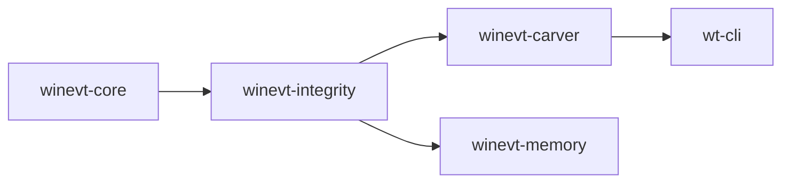

[](https://github.com/SecurityRonin/winevt-forensic/stargazers)
[](LICENSE)
[](https://github.com/SecurityRonin/winevt-forensic/actions/workflows/ci.yml)
[](https://www.rust-lang.org/)
[](#install)
[](https://github.com/sponsors/h4x0r)

# winevt-forensic

**Carve. Verify. Detect.**

Recovers Windows Event Log records from corrupt files, disk images, and memory dumps. Detects structural integrity anomalies — cleared logs, checksum mismatches, record ID gaps — without trusting the file header.

```bash
cargo install wt-cli
wt carve /evidence/Security.evtx
wt verify /evidence/Security.evtx
```

**[Full documentation →](https://securityronin.github.io/winevt-forensic/)**

---

## Install

**Cargo**
```bash
cargo install wt-cli
```

**From source**
```bash
git clone https://github.com/SecurityRonin/winevt-forensic.git
cd winevt-forensic
cargo build --release
./target/release/wt --help
```

**Library crates**
```toml
[dependencies]
winevt-core      = "0.1"   # types + binary format constants
winevt-integrity = "0.1"   # structural anomaly detection
winevt-carver    = "0.1"   # record carving from files, bytes, disk images
```

---

## Three Things You Do With This

### Carve records from a corrupt or cleared EVTX file

```bash
wt carve /evidence/Security.evtx
```

```json
{
  "stats": {
    "bytes_scanned": 1114112,
    "chunks_found": 17,
    "chunks_valid": 14,
    "chunks_corrupt": 3,
    "records_recovered": 4021,
    "records_corrupt": 12
  },
  "indicators": []
}
```

Recovers records even from chunks where the header CRC32 has been tampered with. Falls back to aggressive magic-byte scan when the sequential record walk fails.

### Verify structural integrity

```bash
wt verify /evidence/Security.evtx
```

```json
[
  {
    "ChunkChecksumMismatch": {
      "chunk_offset": 69632,
      "computed": 2881145975,
      "stored": 3735928559
    }
  },
  {
    "RecordIdGap": {
      "chunk_offset": 135168,
      "expected": 4097,
      "found": 4201
    }
  }
]
```

Reports raw structural facts — not forensic conclusions. The interpretive layer (what these facts mean, what intent they imply) belongs to [RapidTriage](https://github.com/SecurityRonin/rapidtriage).

### Carve from raw bytes — disk image, memory dump, slack space

```rust
use winevt_carver::carve_from_bytes;

let raw: Vec<u8> = std::fs::read("/dev/sda")?;
let result = carve_from_bytes(&raw);

println!("Scanned {} bytes, found {} chunks, recovered {} records",
    result.stats.bytes_scanned,
    result.stats.chunks_found,
    result.stats.records_recovered,
);
```

Finds `ElfChnk` magic at any 8-byte offset — no alignment assumptions. Works on memory dumps, unallocated disk space, and partial acquisitions.

---

## What's Different

Every other EVTX tool either parses clean files only or requires the Windows Event Log service. This one is built for the files that break everything else.

| | winevt-forensic | python-evtx | hayabusa | Log Parser Studio |
|--|:-:|:-:|:-:|:-:|
| Runs on Linux / macOS | ✓ | ✓ | ✓ | — |
| Single static binary | ✓ | — | ✓ | — |
| No Python / .NET runtime | ✓ | — | ✓ | — |
| Recovers corrupt chunks | ✓ | — | — | — |
| Carves from raw disk / memory | ✓ | — | — | — |
| CRC32 checksum verification | ✓ | — | — | — |
| Record ID gap detection | ✓ | — | — | — |
| JSON output | ✓ | — | ✓ | — |
| Free & open source | ✓ | ✓ | ✓ | — |

---

## Structural Integrity Checks

`winevt-integrity` checks structural anomalies at the binary level — raw facts, not forensic conclusions:

**Chunk header CRC32 mismatch** — the stored checksum at offset `0x78` does not match a CRC32 of bytes `0x00..0x78`. The chunk header was modified after it was written.

**Record ID gap** — `LastEventRecordNumber` of chunk N + 1 does not equal `FirstEventRecordNumber` of chunk N+1. Records between those IDs are absent from the file.

**File header inconsistency** — `NextRecordId` in the file header is lower than the highest `LastEventRecordId` seen across all chunks. The header was rewritten after records were written.

**Out-of-order timestamps** — a record's timestamp is earlier than the previous record's timestamp within the same chunk. Monotonicity violated.

**Log cleared (EID 1102 / 104)** — the standard Windows event indicating the Security or System log was explicitly cleared.

These facts are inputs to forensic reasoning, not conclusions. [RapidTriage](https://github.com/SecurityRonin/rapidtriage) consumes them and produces the interpretive layer.

---

## Crate Structure

<details>
<summary>Show crate layout</summary>

| Crate | What it does |
|-------|-------------|
| [`winevt-core`](crates/winevt-core/) | Binary format constants (`ELFFILE_MAGIC`, `ELFCHNK_MAGIC`, `RECORD_MAGIC`), domain types (`EvtxEvent`, `LogonSession`), `IntegrityIndicator` enum. Zero external deps. |
| [`winevt-integrity`](crates/winevt-integrity/) | Detection algorithms — `detect_record_id_gaps()`, `verify_chunk_header_checksum()`, `check_timestamp_monotonicity()`, `check_file_header_consistency()` |
| [`winevt-carver`](crates/winevt-carver/) | EVTX chunk/record recovery from corrupt files, raw bytes, disk images. `carve_from_bytes()`, `carve_from_file()`, `verify_integrity()`. |
| [`winevt-memory`](crates/winevt-memory/) | Types and analysis for EVTX/ETW data recovered from memory dumps. `MemoryRecoveredChunk`, `RecoveredEtwSession`, `detect_etw_tampering()`. |
| [`wt-cli`](crates/wt-cli/) | `wt` binary — wraps `winevt-carver`, outputs JSON. |

</details>

```toml
# Use the carver in your own project
[dependencies]
winevt-carver = "0.1"
```

---

## Dependency Graph



---

## EVTX Binary Format Reference

<details>
<summary>Show format reference</summary>

### File Header (128 bytes at offset 0)

| Offset | Size | Field |
|--------|------|-------|
| 0x00 | 8 | Magic `ElfFile\0` |
| 0x08 | 8 | FirstChunkNumber |
| 0x10 | 8 | LastChunkNumber |
| 0x18 | 8 | NextRecordId |
| 0x28 | 2 | HeaderBlockSize (0x1000) |
| 0x2A | 2 | ChunkCount |
| 0x78 | 4 | FileFlags (0x1=dirty, 0x2=full) |
| 0x7C | 4 | Checksum (CRC32 of 0x00..0x78) |

### Chunk Header (128 bytes at chunk start, chunk size = 64 KiB)

| Offset | Size | Field |
|--------|------|-------|
| 0x00 | 8 | Magic `ElfChnk\0` |
| 0x08 | 8 | FirstEventRecordNumber |
| 0x10 | 8 | LastEventRecordNumber |
| 0x34 | 4 | EventRecordsChecksum (CRC32 of records area) |
| 0x78 | 4 | HeaderChecksum (CRC32 of 0x00..0x78) |

### Event Record

| Offset | Size | Field |
|--------|------|-------|
| 0x00 | 4 | Magic `\x2a\x2a\x00\x00` |
| 0x04 | 4 | Size (total including header + trailer) |
| 0x08 | 8 | RecordId |
| 0x10 | 8 | Timestamp (Windows FILETIME) |
| 0x18 | … | BinXml payload |
| Size-4 | 4 | CopyOfSize (for backward traversal) |

Records start at chunk offset `0x200`. Each chunk is exactly `0x10000` bytes.

</details>

---

## Related Projects

- **[RapidTriage](https://github.com/SecurityRonin/rapidtriage)** — consumes winevt-forensic for EVTX carving; provides session correlation, frequency analysis, and the `rt` CLI
- **[srum-forensic](https://github.com/SecurityRonin/srum-forensic)** — sister library for Windows SRUM (ESE) forensics
- **[evtx](https://github.com/omerbenamram/evtx)** — full EVTX parser for normal (non-corrupt) files
- **[hayabusa](https://github.com/Yamato-Security/hayabusa)** — Sigma-based EVTX detection; complements this library

---

## Acknowledgements

**Eric Zimmerman** whose [EVTX Explorer](https://ericzimmerman.github.io/#!index.md) and [Timeline Explorer](https://ericzimmerman.github.io/#!index.md) tools established the gold standard for Windows event log analysis and documented the format in public tooling.

**Omer Ben-Amram** whose [evtx](https://github.com/omerbenamram/evtx) Rust crate proved EVTX parsing in safe Rust was viable and provided an authoritative reference implementation.

**The Rust [crc32fast](https://github.com/srijs/rust-crc32fast)** team for a correct, fast CRC32 implementation — EVTX uses standard ISO 3309 (same polynomial).

**[Akhil Dara](https://www.linkedin.com/in/akhil-dara/)** — first star, before the build was even finished, let alone advertised. That means something.

---

[Privacy Policy](https://securityronin.github.io/winevt-forensic/privacy/) · [Terms of Service](https://securityronin.github.io/winevt-forensic/terms/) · © 2026 Security Ronin Ltd.
